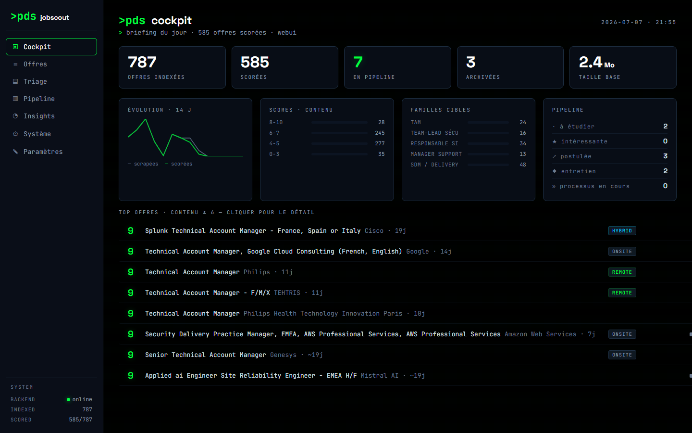
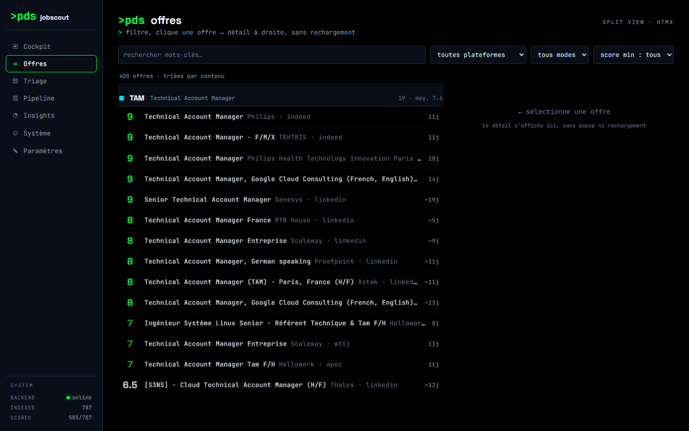
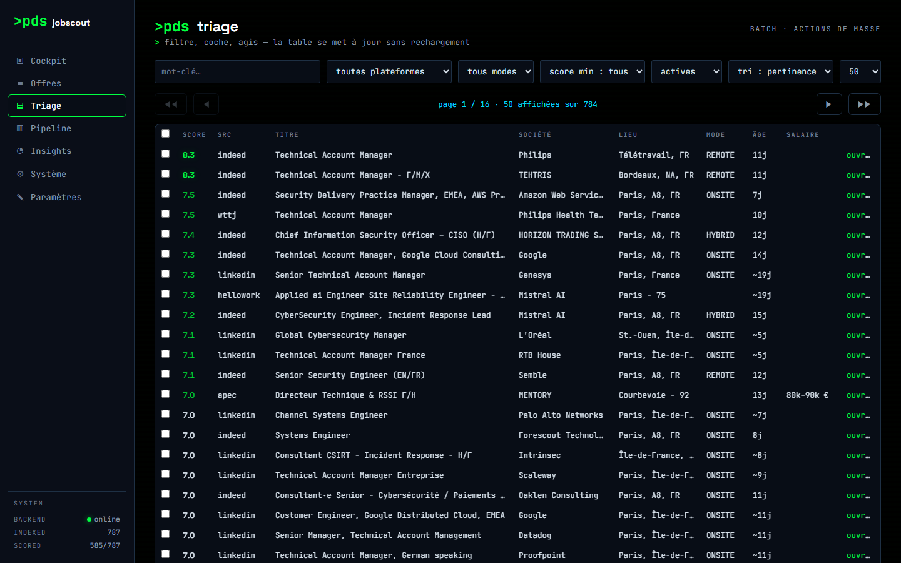
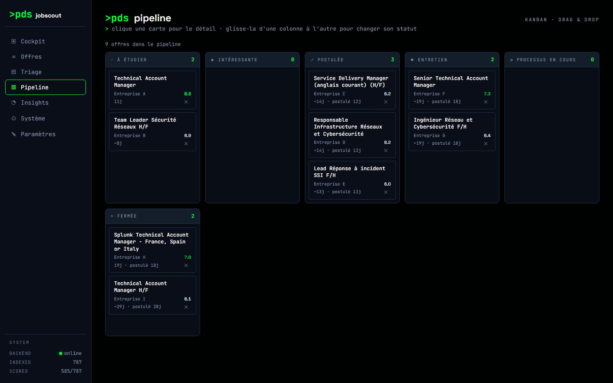
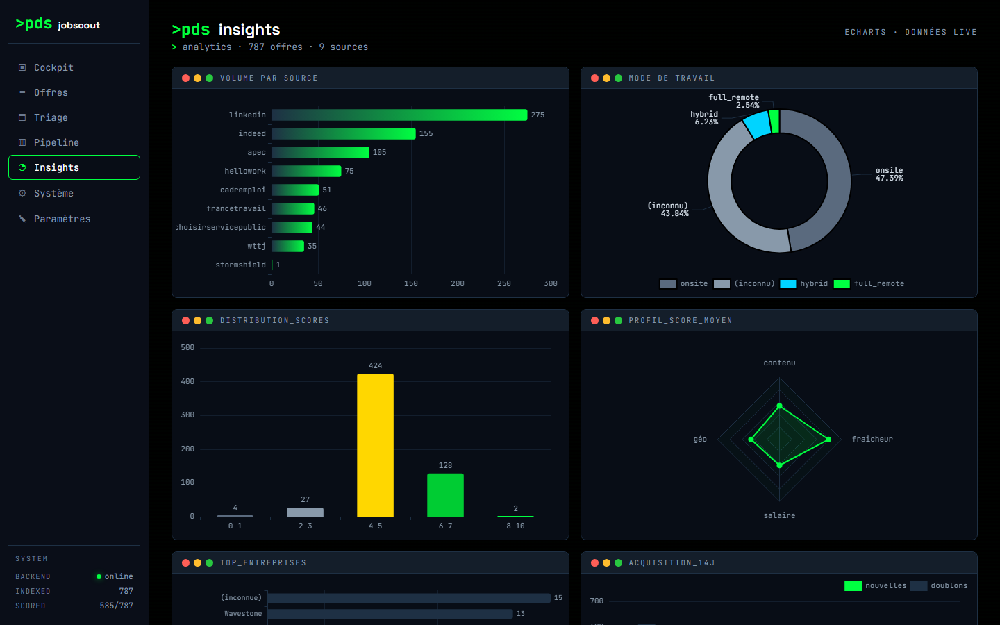
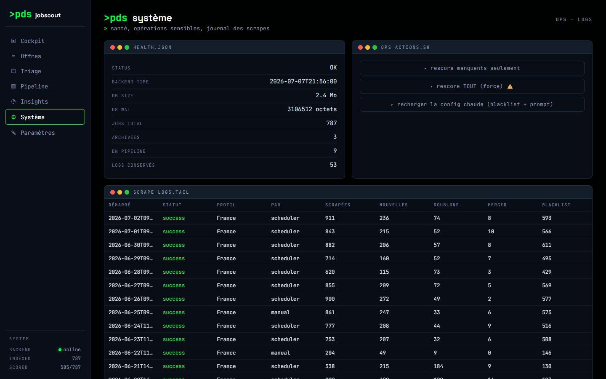

# JobScout

Self-hosted job board aggregator with a twist: instead of you searching job
boards, JobScout scrapes them for you, deduplicates across platforms, and
scores every listing 0–10 against **your own** target profile using an LLM +
deterministic rules — so you only ever look at a ranked, filtered list.

Think of it as a reverse-ATS: you define once who you're looking to become,
and it tells you which of the hundreds of new postings each day are actually
worth your time.



## Features

- **Multi-source scraping** — LinkedIn & Indeed via [JobSpy](https://github.com/cullenwatson/JobSpy),
  plus purpose-built connectors for France Travail, APEC, Welcome to the
  Jungle, HelloWork, Cadremploi, Free-Work, Greenhouse, Workday and
  "Choisir le Service Public" (`backend/connectors/`).
- **Cross-platform dedup** — same listing seen on two boards is merged into
  one row (`content_hash` + `(platform, job_url)`), not duplicated.
- **Hybrid scoring** — an LLM grades *content quality only* (role fit,
  seniority, company, description quality); geography, salary and freshness
  are scored deterministically in Python and recombined into a weighted final
  score. No LLM call needed to re-rank when you tweak the weights.
- **5 LLM providers, swappable at runtime** — Groq, OpenRouter, Anthropic,
  OpenAI, Google Gemini (all through OpenAI-compatible endpoints). Configure
  keys and provider order from the UI, test a connection before saving.
- **Hot-reloadable config** — blacklist, scoring prompt, geo scope, search
  terms and provider settings all live under `./config/`, editable from the
  **Paramètres** page or by hand, reloaded via `POST /config/reload` with
  **no rebuild**.
- **Kanban application tracker** — drag a listing from *to study* through
  *applied* / *interview* to *closed*; JobScout never touches or purges
  anything you've curated this way.
- **Analytics dashboard** — volume by source, score distribution, work-mode
  split, top companies, acquisition trend — all server-rendered ECharts, no
  client-side data fetching.
- **Manual LLM-scoring bridge** (`claude_score.py`) — when your free-tier LLM
  quota runs dry, pipe unscored listings through any chat-based LLM session
  and write the scores back directly.
- **Geographic + link maintenance daemon** (`maintenance/`) — an optional
  host-side process that retroactively purges out-of-scope listings and
  prunes dead links, independent of the Docker containers.

## Screenshots

| | |
|---|---|
|  **Offres** — filterable split view, click a listing → detail pane, no page reload (HTMX). |  **Triage** — paginated table, bulk actions, sortable by score/date/salary. |
|  **Pipeline** — Kanban board, native drag & drop between application stages. |  **Insights** — source volume, score distribution, work-mode split, top companies. |
|  **Système** — health, scrape log tail, one-click rescoring/config-reload actions. | *(company names in the pipeline screenshot are redacted example data)* |

## Quickstart

```bash
git clone https://github.com/lagide/jobscout-public.git jobscout
cd jobscout
cp .env.example .env
# edit .env — at minimum set one scoring provider key (GROQ_API_KEY is free)

docker compose up -d --build
```

- UI: http://localhost:8502
- API docs: http://localhost:8000/docs

Or skip the build and pull the images published by this repo's CI (see
[Docker images](#docker-images) below):

```bash
docker pull ghcr.io/lagide/jobscout-public-backend:latest
docker pull ghcr.io/lagide/jobscout-public-webui:latest
```

On first boot, tables are created automatically and the scheduler runs its
first scrape after `REFRESH_INTERVAL_HOURS` (or immediately if
`RUN_ON_STARTUP=true`).

## Adapt it to your own profile

JobScout ships with an **example profile** (senior cybersecurity Technical
Account Manager) so it's usable out of the box, but the whole point is to
replace it with yours:

1. **`config/scoring_prompt.txt`** — the LLM system prompt. Rewrite the
   target profile, priority tiers and disqualification rules. Reload with
   `POST /config/reload` or the Paramètres page, no rebuild.
2. **`backend/constants.py`** (`SEARCH_TERMS`) — the job titles actually
   queried on each platform. Requires a rebuild (`docker compose build backend`).
3. **`config/geo_scope.json`** — which locations count as "in range" for
   hybrid/onsite roles (full-remote is always national). Regenerate it
   around your own location:
   ```bash
   python3 scripts/generate_geo_scope.py \
     --name "Lyon" --lat 45.7640 --lon 4.8357 --radius-km 60 \
     -o config/geo_scope.json
   ```
4. **`config/blacklist.json`** — title/company patterns to reject before
   they ever reach the LLM (saves API calls). Editable live from Paramètres.
5. **Scoring weights** (content / geo / salary / freshness / competition) —
   Paramètres page, with a "recompute without calling the LLM" button.

## Configuration reference

Priority order (highest wins): `config/settings.json` (edited via the UI) >
`.env` (defaults at first boot) > hardcoded defaults in `backend/constants.py`
/ `backend/scoring.py`. Secrets follow the same pattern with
`config/secrets.json`. See `.env.example` for the full list of variables;
the key ones:

| Variable | Purpose |
|---|---|
| `GROQ_API_KEY` / `OPENROUTER_API_KEY` / `ANTHROPIC_API_KEY` / `OPENAI_API_KEY` / `GEMINI_API_KEY` | Scoring provider keys (fallback if not set via the UI) |
| `FT_CLIENT_ID` / `FT_CLIENT_SECRET` | France Travail connector OAuth credentials |
| `REFRESH_INTERVAL_HOURS`, `RUN_ON_STARTUP` | Scheduler cadence |
| `JOB_RETENTION_DAYS`, `JOB_NOT_SEEN_DAYS` | Daily cleanup thresholds (curated/archived jobs are never touched) |
| `JOBSCOUT_ADMIN_TOKEN` | If set, the webui requires header `X-JobScout-Admin` for write actions — useful for a read-only public deployment behind a reverse proxy |
| `ALLOWED_ORIGINS` | CORS allow-list — the API has no authentication, don't expose it publicly without a proxy in front |

## Architecture

```
                 ┌─────────────┐      scrape/score      ┌──────────────┐
   job boards ──▶│  connectors │────────────────────────▶│   backend    │
                 └─────────────┘                          │ FastAPI+SQLite│
                                                            │ APScheduler  │
                                                            └──────┬───────┘
                                                                   │ HTTP (server-side)
                                                            ┌──────▼───────┐
                                                            │    webui     │
                                                            │ HTMX+Jinja2  │
                                                            │  + ECharts   │
                                                            └──────────────┘
```

- **`backend/`** — FastAPI + SQLAlchemy + APScheduler, scrapes, dedupes,
  enriches (work mode / language / EUR salary via frankfurter.app), scores,
  and serves the JSON API (`main.py`, ~25 endpoints — `/docs` for the full
  list). Playwright-based image (some connectors need a real browser).
- **`webui/`** — thin FastAPI + Jinja2 + HTMX + ECharts frontend that talks
  to the backend server-side (no CORS, no client-side API key exposure).
  ~150 MB image, no Playwright/pandas.
- **SQLite** — single file in a named Docker volume, WAL mode.

## Docker images

`.github/workflows/docker-publish.yml` builds both images (linux/amd64 +
linux/arm64 — including Raspberry Pi / ARM NAS) and pushes them to the GitHub
Container Registry on every push to `main` and on version tags, using the
built-in `GITHUB_TOKEN` (nothing to configure). See the workflow file to
adjust triggers or add a registry of your choice.

## Tests

```bash
docker exec jobscout-backend python -m unittest discover -s tests -v
```

Pure-function tests only (scoring formula, freshness decay, salary
brackets, blacklist matching, geo scope, dedup hashing) — no DB or network
access required.

## Scripts

| Script | Purpose |
|---|---|
| `claude_score.py` | `fetch N` prints N unscored jobs as JSON; `write` reads back `{id, score, reasoning}` and recomputes the final weighted score. Root may be required if the DB volume is root-owned. |
| `purge_blacklisted.py` | Retroactively deletes DB rows matching the *current* blacklist (`--dry-run` first). Never touches curated/archived jobs. |
| `scripts/generate_geo_scope.py` | Regenerates `config/geo_scope.json` from geo.api.gouv.fr around any origin/radius. |
| `scripts/backup_db.sh` | Consistent SQLite snapshot (`sqlite3 .backup`, safe under WAL) + 7-day rotation. |
| `scripts/healthcheck.sh` | External probe + `docker restart` on failure (Docker's own healthcheck is disabled — a known 24.0.2 daemon crash bug on some NAS distros). |
| `maintenance/` | Optional host-side daemon: hourly geo-scope re-check + daily dead-link sweep. See `maintenance/README.md`. |

## License

[MIT](LICENSE)
